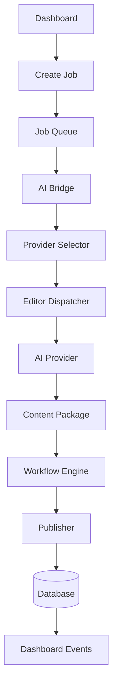
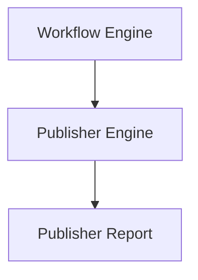
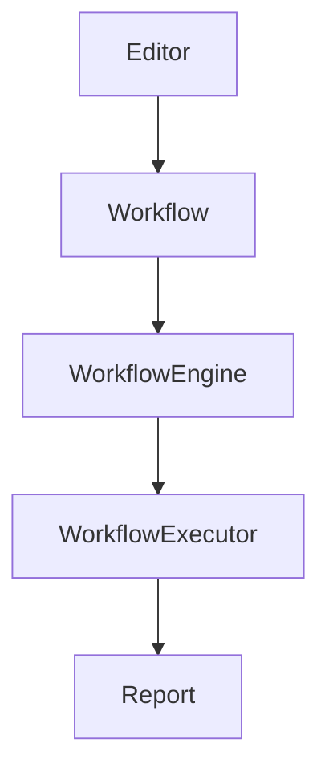
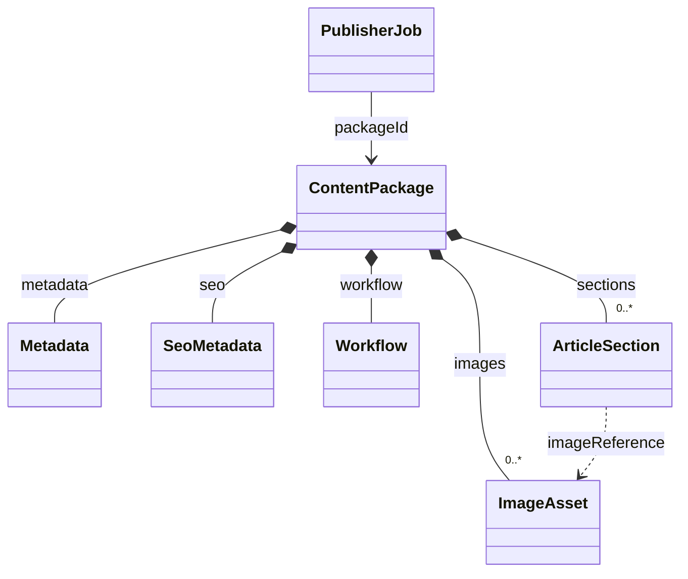
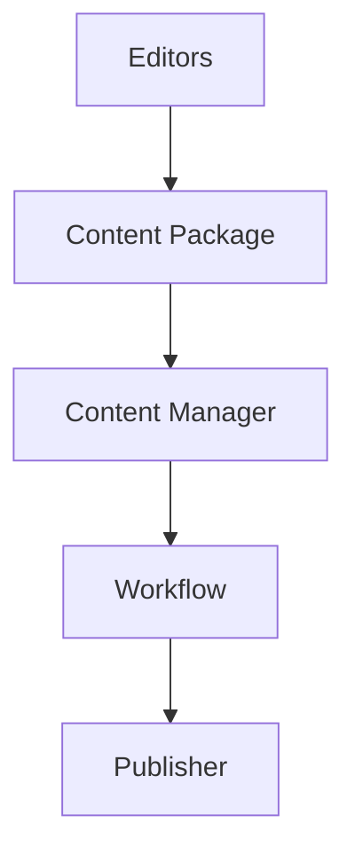
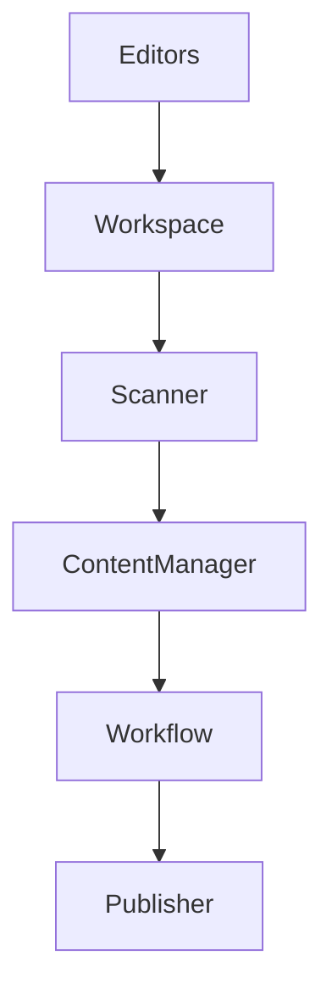
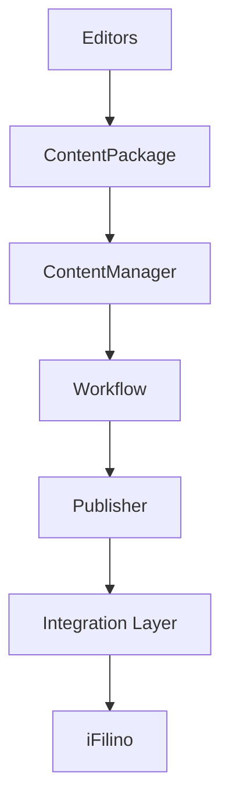
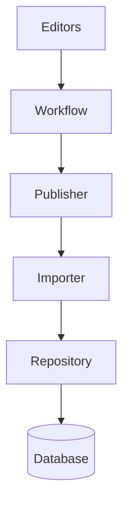
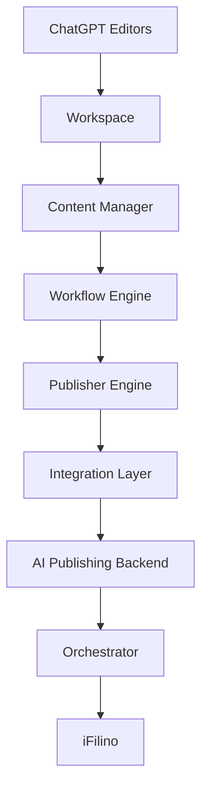
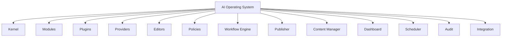

# Infrastructure de rédaction IA iFilino

Ce répertoire prépare une architecture commune pour cinq rédactions :
iFilino Discover, iFilino Sports, iFilino Kids, iFilino Stories et iFilino
GamingHub.

Le socle inclut désormais des moteurs génériques et un AI Bridge. Le mode par défaut utilise MockProvider et n’appelle aucune API externe. Les accès réels aux providers, au workflow et au publisher restent injectés par configuration.

## AI Bridge

Le dossier `bridge/` relie les services du Dashboard au pipeline IA sans exposer les fournisseurs. Le Dashboard crée des `Job`; la queue, le sélecteur de provider, le dispatcher d’éditeur et l’exécuteur prennent ensuite le relais.



Documentation : `docs/AIBridge.md`, `docs/Jobs.md`, `docs/Queue.md`, `docs/Providers.md`, `docs/Events.md`, `docs/Execution.md` et `docs/DashboardIntegration.md`.

## Principes

- **Isolation** : l’infrastructure vit sous `ai/` et ne dépend pas des
  fonctionnalités existantes.
- **Contrats avant implémentation** : les échanges futurs passent par des
  interfaces TypeScript documentées.
- **Format canonique** : `ContentPackage` est indépendant des modèles de
  données de chaque produit.
- **Configuration déclarative** : les éditeurs, chemins et paramètres du
  publisher sont décrits par JSON.
- **Revue humaine** : les workflows prévoient une validation avant toute
  publication future.
- **Extensibilité** : chaque canal possède ses espaces d’éditeur, workflow,
  prompts et templates.

## Arborescence

```text
ai/
├── README.md
├── tsconfig.json
├── config/
│   ├── README.md
│   ├── editors.json
│   ├── paths.json
│   └── publisher.json
├── editors/
│   ├── README.md
│   ├── discover/
│   ├── sports/
│   ├── kids/
│   ├── stories/
│   └── gaming/
├── publisher/
├── queue/
│   ├── incoming/
│   ├── processing/
│   ├── published/
│   └── failed/
├── templates/
│   ├── discover/
│   ├── sports/
│   ├── kids/
│   ├── stories/
│   └── gaming/
├── workflows/
│   ├── discover.md
│   ├── sports.md
│   ├── kids.md
│   ├── stories.md
│   ├── gaming.md
│   └── publish.md
├── prompts/
│   ├── discover/
│   ├── sports/
│   ├── kids/
│   ├── stories/
│   └── gaming/
├── types/
├── services/
├── logs/
├── scripts/
└── tests/
```

Chaque dossier contient un `README.md` qui précise son rôle et ses limites.

## Chaîne de publication générique



Le Publisher Engine reçoit un `ContentPackage`, orchestre uniquement des phases
injectées et retourne un rapport. Il ne publie aucun article et ne connaît
aucun produit iFilino.

## Orchestration des workflows



Le moteur reste générique : l’éditeur fournit une définition et des handlers,
le moteur contrôle puis orchestre leur exécution, et retourne uniquement un
rapport structuré. Aucun Publisher ne participe à cette chaîne.

## Relations entre les contrats



`ContentPackage` est l’agrégat racine. `PublisherJob` ne l’embarque pas : il
le référence par son identifiant afin de préserver un contrat de file minimal.
`ArticleSection.imageReference` pointe vers l’identifiant d’un `ImageAsset`.

## Rôle des dossiers

### `config/`

Contient les manifestes non secrets :

- `editors.json` référence les cinq éditeurs, leur canal et leurs ressources ;
- `publisher.json` décrit la file et les garanties attendues, avec le
  publisher désactivé ;
- `paths.json` centralise tous les chemins relatifs.

### `editors/`

Réserve un module indépendant à chaque rédaction. Une future implémentation
recevra un brief normalisé et retournera un `EditorResult`. Aucun éditeur
n’existe encore sous forme exécutable.

### `publisher/`

Contient le Publisher Engine générique : validation structurelle, pipeline de
phases injectées, journalisation en mémoire et rapport complet. Il ne contient
aucun connecteur et ne connaît aucun produit cible.

### `queue/`

Prépare le cycle d’un futur `PublisherJob` :

- `incoming/` : travail reçu et en attente ;
- `processing/` : travail réservé par un futur worker ;
- `published/` : description d’un travail terminé ;
- `failed/` : travail en échec avec diagnostic.

Ces dossiers ne sont surveillés par aucun processus.

### `templates/`

Accueillera les structures de sortie : plans d’articles, formats de blocs,
gabarits SEO et variantes par canal.

### `workflows/`

Décrit en Markdown les étapes, entrées, sorties, contrôles et limites de chaque
rédaction, ainsi que le futur cycle de publication. Ces documents ne sont pas
des scripts.

### `prompts/`

Accueillera les instructions versionnées propres à chaque éditeur. Les
informations d’accès aux fournisseurs IA n’y auront pas leur place.

### `types/`

Contient les contrats TypeScript partagés :

- `ContentPackage.ts` : unité d’échange canonique ;
- `Metadata.ts` : métadonnées éditoriales et de suivi ;
- `EditorResult.ts` : résultat normalisé d’un éditeur ;
- `PublisherJob.ts` : description d’un travail de file ;
- `Workflow.ts` : workflow et étapes déclaratives ;
- `ImageAsset.ts` : média référencé ou attendu ;
- `index.ts` : point d’export des types.

### `examples/`

Contient un `ContentPackage` fictif et valide pour chacune des cinq rédactions.
Ces fichiers servent de fixtures aux tests de contrat.

### `schema/`

Contient les quatre schémas JSON Schema Draft 2020-12 qui valident le paquet,
les métadonnées, le SEO et les images.

### `workflow-engine/`

Contient le moteur générique chargé d’enregistrer, valider et exécuter des
étapes injectées dans leur ordre déclaratif. Il ne connaît aucun éditeur et
ne contient aucune action de génération ou de publication.

### `services/`

Réservé aux futures abstractions techniques partagées. Aucun service n’est
implémenté.

### `logs/`

Réservé aux journaux locaux. Un `.gitignore` empêche l’ajout accidentel des
fichiers produits à l’exécution.

### `scripts/`

Réservé aux futurs outils manuels et de maintenance. Aucun script n’est
présent.

### `tests/`

Accueillera les validations des schémas, configurations et futures
implémentations.

## Cycle de vie prévu d’un article

Le cycle suivant est une spécification pour les prochaines phases, pas un
processus actif :

1. Un **brief éditorial** est attribué à l’un des éditeurs déclarés.
2. L’éditeur suit son **workflow spécialisé**.
3. Il retourne un **`EditorResult`**.
4. Lorsque le résultat est `ready`, il contient un **`ContentPackage`**.
5. Une **revue humaine** contrôle le fond, les sources, les médias et le canal.
6. Un futur orchestrateur encapsule le paquet validé dans un
   **`PublisherJob`** placé dans `queue/incoming/`.
7. Un futur worker déplace le travail vers `processing/`.
8. Le futur publisher adapte le paquet au produit cible.
9. Le travail termine dans `published/` ou `failed/`.

Les étapes 1 à 9 ne sont pas implémentées dans cette livraison.

## Format attendu d’un `ContentPackage`

Un paquet doit être sérialisable, autonome et indépendant du stockage final.
Son contrat de référence se trouve dans
[`types/ContentPackage.ts`](types/ContentPackage.ts).

Le paquet exige les propriétés suivantes : `id`, `editor`, `category`,
`language`, `createdAt`, `updatedAt`, `articleMarkdown`, `sections`, `metadata`,
`images`, `seo`, `workflow`, `version` et `status`. Les sous-objets sont définis
par les interfaces dédiées et interdisent les propriétés inconnues dans leur
représentation JSON Schema.

Les cinq exemples complets et validés sont disponibles dans [`examples/`](examples/).
Ils constituent la référence sérialisée du contrat avec les schémas de
[`schema/`](schema/).

## Extension de l’architecture

Pour préparer un nouvel éditeur lors d’une phase future :

1. ajouter son entrée dans `config/editors.json` ;
2. créer ses dossiers dans `editors/`, `prompts/` et `templates/` ;
3. documenter son workflow dans `workflows/` ;
4. étendre l’union `EditorId` de `ContentPackage` ;
5. ajouter les tests de contrat avant toute implémentation.

Une implémentation future devra conserver la séparation entre préparation,
validation, file et publication.

## Content Package Manager

Le module [`content-manager/`](content-manager/) centralise le cycle de vie des
`ContentPackage`. Il normalise et valide les packages, conserve leurs snapshots
en mémoire, crée des versions séquentielles, gère les archives et fournit les
comparaisons, historiques et statistiques. Il reste indépendant de tout produit,
stockage externe ou mécanisme de publication.



## FileSystem Connector

Le module [`filesystem/`](filesystem/) fournit une convention portable de dépôt,
lecture et scan des `ContentPackage`. Le workspace est limité aux files standard,
le watcher reste une interface inactive et aucun traitement métier ou publication
n'est déclenché.



## Couche Integration

Le module [`integration/`](integration/) prépare un `ContentPackage` pour une
cible iFilino au moyen des contrats de [`adapters/`](adapters/). Il produit
uniquement un artefact descriptif et un reçu réversible en mémoire. Il ne copie
aucun asset et ne contacte aucun backend.



## Backend AI Publisher

Le module isolé
[`backend/src/modules/ai-publisher`](../backend/src/modules/ai-publisher/)
reçoit les packages validés, sélectionne un importer et confie leur
enregistrement atomique à un repository. Aucun modèle ou route existante ne
dépend directement de ce module.



## AI Orchestrator

Le module [`orchestrator/`](orchestrator/) coordonne tous les composants au moyen
de ports injectables. La file, le scheduler, les retries, les métriques, les
probes de santé et les historiques restent indépendants du backend et des écrans.



## AI Operating System

Le dossier [`os/`](os/) transforme la plateforme en noyau configuration-driven.
Modules, plugins, providers, modèles, éditeurs, politiques, permissions, audit,
dashboard, schedulers et extensions sont enregistrés dynamiquement.



## Limites de cette phase

- aucune logique métier ;
- aucun fournisseur IA ;
- aucun accès réseau ;
- aucun accès à la base de données ;
- aucun import vers Discover ou un autre produit ;
- aucun worker de file ;
- aucune publication ;
- aucune modification fonctionnelle du projet existant ;
- aucun commit automatique.
