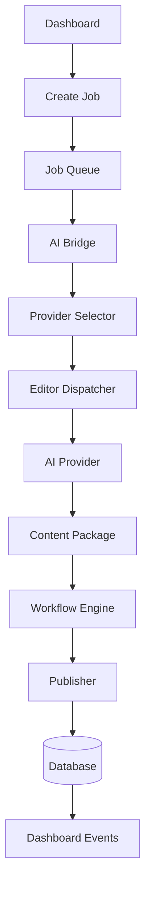

# AI Bridge

`AIBridge` est la façade applicative. Il expose création, exécution, pause, reprise, annulation, retry, santé et métriques. `BridgeFactory` constitue le graphe de dépendances et peut être remplacé par un composition root backend.

