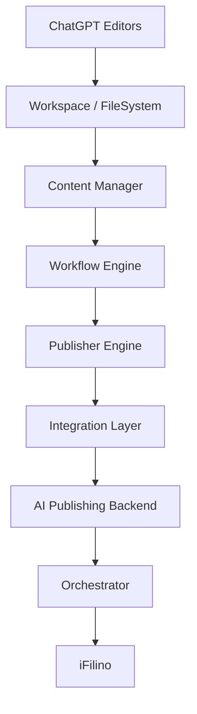

# Architecture

La plateforme repose sur un contrat unique, `ContentPackage`, transporté entre
des modules indépendants. Chaque module expose un point d'entrée TypeScript et
ne connaît que les contrats de la couche précédente.

Le bootstrap vérifie les fichiers, configurations, exemples, tests et imports
circulaires. L'orchestrateur utilise l'injection de dépendances ; le backend est
accessible par un port et reste le seul composant autorisé à encapsuler une
transaction de base de données.

## Ajouter un éditeur

Étendre `EditorId`, ajouter ses exemples et workflow, créer un adapter
`IntegrationAdapter`, un importer dérivé de `BaseImporter`, puis l'enregistrer
dans la racine de composition. Aucun moteur générique ne doit être modifié.
