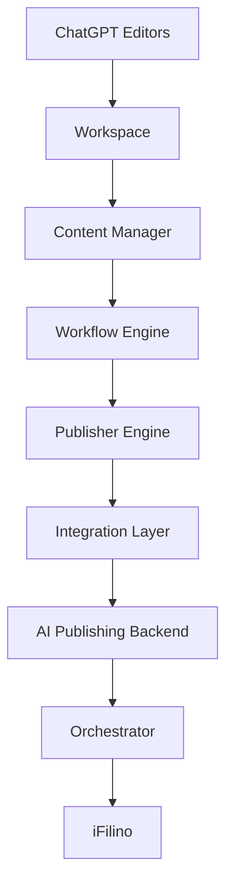

# AI Orchestrator

L'orchestrateur coordonne le pipeline IA complet au moyen de ports injectables.
Il ne dépend directement ni du backend, ni des routes, ni des produits iFilino.

## Pipeline par défaut

1. FileSystem
2. Content Manager
3. Workflow Engine
4. Publisher Engine
5. Integration Layer
6. AI Publisher backend
7. Archive optionnelle

Chaque port expose `execute()` et `health()`. Un déploiement futur peut donc
adapter les modules réels sans introduire de dépendance circulaire.

La file, les métriques, les logs et l'historique sont en mémoire. Le scheduler
ne planifie que sur appel explicite. Les hooks notifications, webhooks, Slack,
Discord et Email sont des contrats optionnels sans implémentation.

