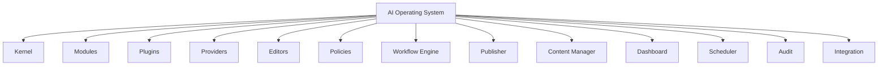

# AI Operating System

Noyau configuration-driven multi-sites, multi-éditeurs et multi-fournisseurs.
Il assemble uniquement des registries et ports injectés, sans API fournisseur.

```mermaid
flowchart TD
 OS[AI Operating System] --> K[Kernel]
 OS --> M[Modules]
 OS --> P[Plugins]
 OS --> PR[Providers]
 OS --> E[Editors]
 OS --> PO[Policies]
 OS --> W[Workflow Engine]
 OS --> PU[Publisher]
 OS --> C[Content Manager]
 OS --> D[Dashboard]
 OS --> S[Scheduler]
 OS --> A[Audit]
 OS --> I[Integration]
```
