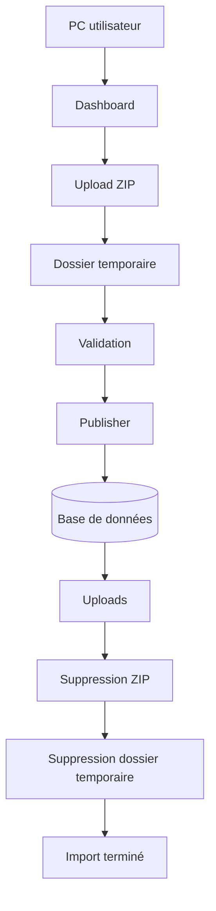

# AI Package Import

```mermaid
flowchart TD
 PC[PC utilisateur] --> D[Dashboard]
 D --> Z[Upload ZIP]
 Z --> T[Dossier temporaire]
 T --> V[Validation]
 V --> P[Publisher]
 P --> DB[(Base de données)]
 DB --> U[Uploads]
 U --> DZ[Suppression ZIP]
 DZ --> DT[Suppression dossier temporaire]
 DT --> C[Import terminé]
```

Les états sont `Waiting`, `Uploading`, `Uploaded`, `Extracting`, `Validating`, `Ready`, `Publishing`, `Published`, `Cleaning`, `Completed` et `Failed`.
