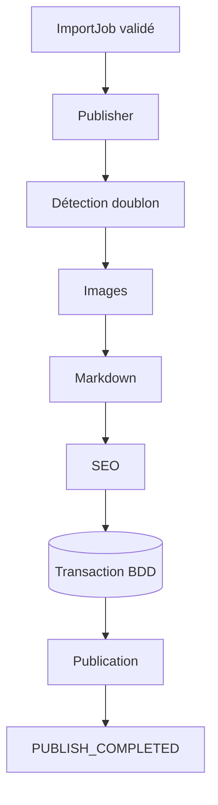

# AI Publisher

Le Publisher reçoit exclusivement un `ImportJob` déjà validé. Il est indépendant du Dashboard et peut être appelé par AI Import, un workflow, un scheduler ou une API.

Modules pris en charge : `discover`, `sports`, `kids`, `stories`, `gaming`, `marketplace`.
